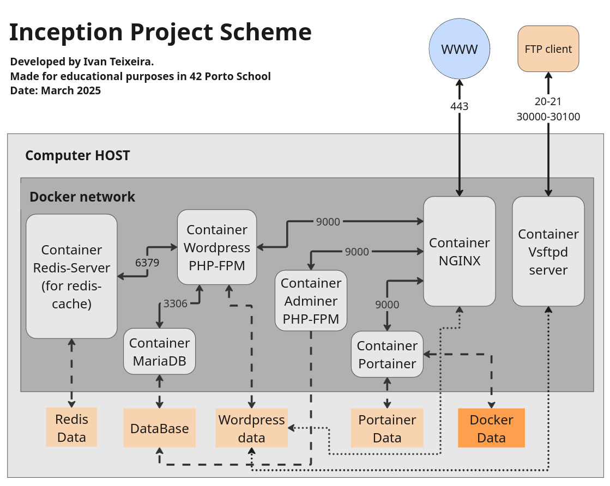

# 🐳 Inception

A Docker containerized WordPress infrastructure with NGINX, MariaDB, and additional services.

This project implements a complete web infrastructure using Docker containers, with each service running in its own dedicated container according to best practices. It's designed as an educational project to demonstrate containerization concepts and multi-service orchestration.

## 🏗️ Infrastructure Overview



The infrastructure consists of the following components:

### Core Services
- **NGINX**: 🌐 Web server with TLS/SSL, the only entry point to your infrastructure
- **WordPress + PHP-FPM**: 📝 Content management system
- **MariaDB**: 💾 Database server

### Bonus Services
- **Redis**: ⚡ Cache for WordPress to improve performance
- **FTP Server**: 📂 Using Vsftpd, for file uploads to WordPress directory
- **Adminer**: 🔍 Database management interface
- **Portainer**: 🔧 Docker container management UI

## ✅ Requirements

- Docker Engine 20.10.x+
- Docker Compose 1.25.x+
- Make

## 🚀 Getting Started

### Installation

1. Clone the repository:
```bash
git clone https://github.com/isilva-t/42.Inception
cd 42.Inception/project
```

2. Run the setup:
```bash
make
```

This will:
- Create necessary data directories
- Extract configuration secrets
- Build Docker images
- Set up the Docker network

3. Start the services:
```bash
make up       # Start in detached mode
# OR
make uplog    # Start with logs in foreground
```

4. Access your services:
   - WordPress: https://localhost
   - WordPress backoffice and redis plugin: https://localhost/wp-admin
   - Adminer: https://localhost/adminer
   - Portainer: https://localhost/portainer

## ⚠️ Disclaimer

**Important**: This project is intended for educational purposes only. The passwords and credentials displayed in this README are deliberately included to facilitate learning and easy setup in a controlled environment. In a real-world production scenario, these credentials should never be:

1. Hardcoded in documentation
2. Committed to version control
3. Shared publicly

For actual deployments, always use:
- Environment variables
- Secret management solutions
- Secure credential storage
- Strong, unique passwords

By making the credentials visible here, we aim to simplify the educational experience and allow users to focus on understanding Docker containerization concepts without authentication barriers during the learning process.

Additionally, this project uses `localhost` as the default host to enable straightforward setup without requiring modifications to the `/etc/hosts` file. This design choice allows users to get started immediately without system configuration changes, further supporting the educational goals of the project.

### 🔑 Login Information

#### WordPress
- Admin Username: boss
- Admin Password: bosswordpress
- User username: user
- User password: userpass

#### Database
- Username: sqluser
- Password: userpass
- Root Password: rootpass

#### FTP
- URL: localhost
- Username: boss
- Password: bossftp

#### Portainer
- User: admin
- Password: bossportainer

## 🛠️ Make Commands

| Command | Description |
|---------|-------------|
| `make` | Setup the infrastructure (build images) |
| `make up` | Start containers in detached mode |
| `make uplog` | Start containers with logs in foreground |
| `make down` | Stop and remove containers |
| `make clean` | Same as `make down` |
| `make fcleanimsure` | Full cleanup (containers, images, volumes, networks) |
| `make adminer` | Open shell in adminer container |
| `make mariadb` | Open shell in mariadb container |
| `make redis` | Open Redis CLI |

## 📁 Project Structure

```
.
├── Makefile               # Build automation
├── secrets/               # Contains password files
├── srcs/
│   ├── .env               # Environment variables
│   ├── docker-compose.yml # Container orchestration
│   └── requirements/
│       ├── nginx/         # NGINX configuration
│       ├── wordpress/     # WordPress configuration
│       ├── mariadb/       # MariaDB configuration
│       └── bonus/
│           ├── redis/     # Redis cache
│           ├── ftp/       # FTP server
│           ├── adminer/   # Database interface
│           └── portainer/ # Container management
```

## 🔧 Technical Details

### Networking

All services communicate through a Docker network bridge named `myNet`. NGINX is the only container exposed to the host, via port 443 (HTTPS), and serves as the central reverse proxy for the infrastructure. NGINX handles all incoming traffic and redirects requests to the appropriate services:

- Root path (`/`) is directed to WordPress
- `/adminer/` path is redirected to the Adminer service
- `/portainer/` path is redirected to the Portainer management interface

As specifically required by the 42 project subject, a standard FTP server (not SFTP) is implemented and exposes ports 20, 21, and 30000-30100 for passive mode connections.

### Volumes

The project uses several Docker volumes to persist data:
- WordPress files: `/home/username/data/wordpress`
- MariaDB database: `/home/username/data/mariadb`
- Portainer data: `/home/username/data/portainer`
- Redis data: `/home/username/data/redis`

### Security

- 🔒 TLS/SSL with self-signed certificates for HTTPS
- 🔐 Docker secrets for sensitive information
- 🚫 No passwords stored in Dockerfiles
- 🔧 Environment variables for configuration

## ❓ Troubleshooting

### Cannot connect to services

- Run `make uplog` to see logs in real-time
- Verify all containers are running: `docker ps`
- Check container logs: `docker logs <container_name>`
- Ensure ports are not in use by other applications

### WordPress setup issues

- If WordPress doesn't initialize properly, you may need to check the database connection
- Verify MariaDB is running: `make mariadb` then run `mysql -u sqluser -p`

### SSL Certificate Warnings

Since the project uses self-signed certificates, browsers will show security warnings. This is expected and can be bypassed for testing purposes.
